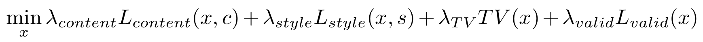

<div align="center">
  <br>
</div>

> It's said that spirits dwell in objects into which people put their feelings. I've always thought that, if that’s true, then the same must be true of artwork. So today, I shall immerse myself in work, so as to impart my own spirit into my creations.  
> -- Weiss Guertena

Guertena is an easy to use, quality oriented python library for neural style transfer.


## Guertena the fast way

Just follow [this tutorial on Google Colab](https://colab.research.google.com/drive/1jvQx95EDjBMak34e12-KYfZd_4Td2Z5t?usp=sharing) to learn how to use Guertena easily.

## Installing Guertena

### Prerequisites

First install a **Python 3, 64-bits** [Conda distribution](https://anaconda.org/anaconda/python).

It is **highly recommended** that you make use of an nVidia GPU, and that your computer has the [appropriate drivers](http://www.nvidia.com//Download/index.aspx) for your operative system and GPU card. You will also need to install a `cudatoolkit` version compatible with your GPU driver.

### Install

To install guertena just run

```python
pip install guertena
```

## Usage

Suppose you have a content image located at the current folder and named `myphoto.png` and you want to transfer the style contained in another picture `style.png`, also located in the current folder. First you will need to load these images with PIL

```python
from PIL import Image

content_image = Image.open("./myphoto.png")
style_image = Image.open("./style.png")
```

Now, to run style transfer with the recommended parameters, just do

```python
from guertena import style_transfer

result = style_transfer(content_image, style_image)
```

Note the default parameters are oriented towards a high quality result, so depending on your GPU and the image size the style transfer can take 5-15 minutes.

Once the style transfer is performed, you can save the result back to disk with

```python
result.save("./result.png")
```

### Optimizing for speed and memory requirements

If the input content image is too large, you might find the style transfer takes too long, or even you get a GPU out of memory error. In that case you optimize the process by requesting a smaller resolution in your output

```python
result = style_transfer(content_image, style_image, output_resolution=512)
```

The `output_resolution` parameter can be a number with the rows of the desired output resolution, or a string in the form "ROWSxCOLUMNS". If only the rows are provided, the columns are rescaled accordingly to maintain aspect ratio.

Additionally, by default Guertena uses a **resolution upscaling** strategy to generate high quality style transfers. This means Guertena starts by generating a result image with resolution `256`, and using it as starting point to produce a larger resolution image. This upscaling procedure is repeated a number of times until the desired resolution is reached. But you can also deactivate this behavior and produce an image directly at the target resolution with

```python
result = style_transfer(content_image, style_image, upscaling_rounds=0)
```

### Advanced usage: tuning algorithm parameters

If the style transfer results do not look good there are several parameters you can tune to obtain different outputs. But first, you will need some basic understanding on how the method works.

Guertena is mainly based on the Neural Style Transfer algorithm by [Leon A. Gatys, Alexander S. Ecker and Matthias Bethge](https://arxiv.org/abs/1508.06576). In this method, the image $x$ to be produced tries to minimize the following cost function



that is, the product image must minimize three different criteria:

* **Content loss**: measures how well the resultant image $x$ matches the original content image $c$. This level of match is computed in terms of the neuron activation values of a VGG19 network that uses the image as input.
* **Style loss**: measures how well the resultant image $x$ matches the provided style image $s$. This level of match is computed in terms of the neuron activation correlations of a VGG19 network that uses the image as input.
* **TV loss**: penalizes neighbouring pixels in $x$ that take very different values, to avoid noise appearing in the result. For more information check [Total Variation denoising](https://en.wikipedia.org/wiki/Total_variation_denoising).
* **Valid pixels loss**: penalizes pixels in $x$ that lie outside the valid pixel values range, $[0, 1]$.

To produce different results we can tune the weights of these three criteria through the appropriate parameters of the `style_transfer` function:

* `content_weight`: larger values force the result to more closely the original image. Default is 1.
* `style_weight`: larger values impose stronger style patterns. Default is 1e6.
* `tv_weight`: larger values produce smoother images. Default is 1.
* `valid_pixels_weight`: larger values enforce a stronger constraint on $x$ having valid pixel values along all the optimization process. Default is 1, and you shouldn't really change it unless you have a very good for it.

When changing this parameters it is recommended to increase/decrease them an order of magnitude. E.g. to imprint a stronger style you could try with

```python
result = style_transfer(content_image, style_image, style_weight=1e7)
```

### Experimental features (use at your own risk)

Guertena also includes the option to change generator function producing the image $x$. Options are:

* `raw`: optimize directly the pixels of $x$ (default)
* `u-net`: use a [U-Net](https://en.wikipedia.org/wiki/U-Net) to produce $x$, and optimize the network parameters of the net instead of the raw pixels values. Note this feature currently produces significantly worse quality results and is slower, but might consume less memory for very large images.

## Tips and tricks

### Generating high resolution images

As you might not have a large GPU readily available, there is a resolution limit to the images you can create before overflowing GPU memory. To circumvent this, you can generate your image at the highest resolution your GPU allows to, and then apply a super-resolution technique.

One super-resolution method I can particularly recommend is [AMD FidelityFX SuperResolution](https://gpuopen.com/fidelityfx-superresolution/). You can readily use it as a Windows executable file [here](https://github.com/GPUOpen-Effects/FidelityFX-CLI?ref=bestofcpp.com), and instructions on how to use it [here](https://gpuopen.com/learn/using-fidelityfx-cli/).

Alternatively, if you don't have a Windows system available, you can use [waifu2x](http://waifu2x.udp.jp/index.es.html).

## References

Guertena builds on many previous methods and implementations of neural style transfer methods. Here are the relevant ones:

* [Gatys et al. - A Neural Algorithm of Artistic Style](https://arxiv.org/abs/1508.06576)
* [Pytorch Neural Style tutorial](https://pytorch.org/tutorials/advanced/neural_style_tutorial.html)
* [Neural Style Torch implementation by jcjohnson](https://github.com/jcjohnson/neural-style)
* [Neural Style Pytorch implementation by ProGamerGov](https://github.com/ProGamerGov/neural-style-pt)
* [Multiresolution strategy by jcjohnson](https://gist.github.com/jcjohnson/ca1f29057a187bc7721a3a8c418cc7db)

## Acknowledgements and disclaimers

The author acknowledges partial financial support (in the form of GPU time) from the following research projects and institutions:

* PID2019-106827GB-I00 / AEI / 10.13039/501100011033
* European Regional Development Fund and Spanish Ministry of Economy, Industry, and Competitiveness - State Research Agency, project TIN2016-76406-P (AEI/FEDER, UE).
* [Grupo de Aprendizaje Autómatico (GAA)](http://arantxa.ii.uam.es/~gaa/index.html), Universidad Autónoma de Madrid (UAM)
* [Instituto de Ingeniería del Conocimiento (IIC)](https://www.iic.uam.es/)

And in case you are wondering, the name *Guertena* and the opening quote come from the excellent, albeit obscure, indie game [Ib](https://vgperson.com/games/ib.htm). I'm not related to it's creator ([kouri](http://kouri.kuchinawa.com/)) nor claim any rights. I'm just a fan of hiw work and wanted to pay homage.
